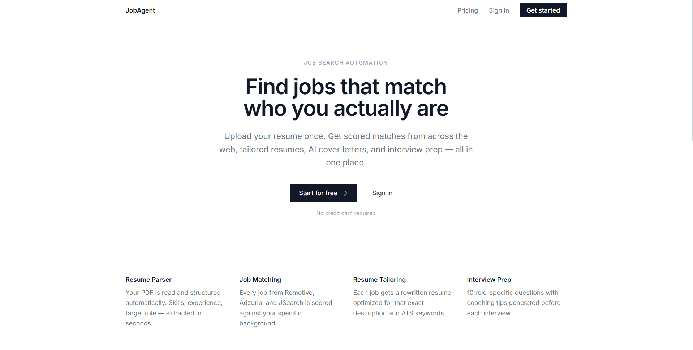
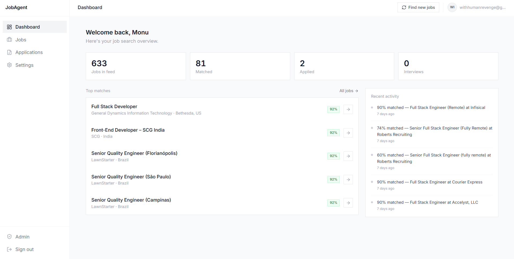
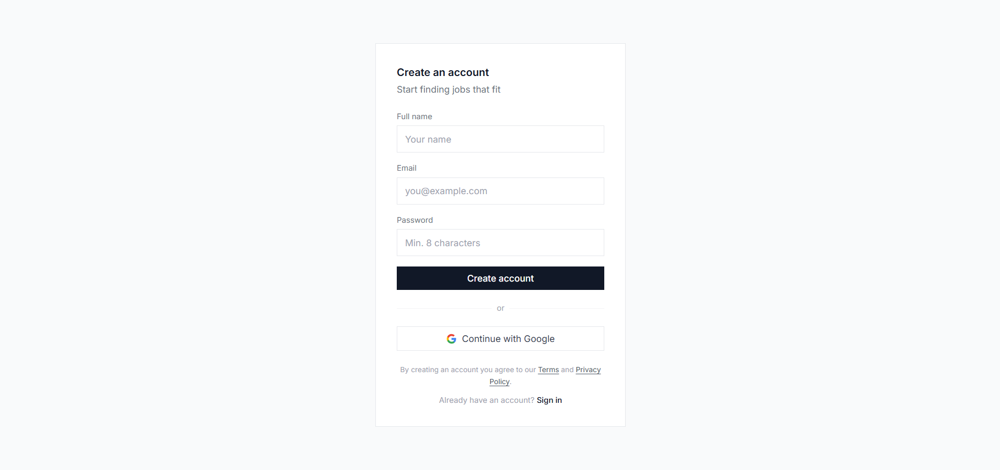
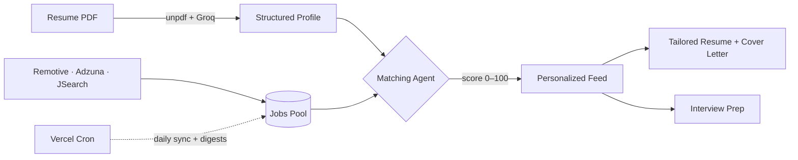

<div align="center">

# JobAgent

**Your AI co-pilot for the job hunt** — upload your resume once, and get every job scored against your real background, with a tailored resume, cover letter, and interview prep ready in one click.

[](https://help-me-get-hired.vercel.app)


</div>

---

## Overview

Job seekers waste hours triaging listings, rewriting the same resume, and guessing what interviewers will ask. **JobAgent** automates the busywork: it continuously pulls roles from multiple job boards, scores each one **0–100** against the user's parsed resume, and — for the matches worth pursuing — generates an ATS-optimized resume, a personalized cover letter, and a set of role-specific interview questions. The user stays in control and applies on the original site; JobAgent does the heavy lifting up to that point.

Built as a production-grade, full-stack SaaS: authentication, a credit-metered billing system with two payment processors, an admin analytics dashboard, background job syncing, transactional email, and a region-aware experience (₹ for India, $ internationally).

> **Try it live:** [help-me-get-hired.vercel.app](https://help-me-get-hired.vercel.app)

---

## Screenshots

**Landing**



**Dashboard** — every job scored against your resume, with pipeline stats and a live match activity feed



**Sign up** — email/password or Google OAuth



---

## Features

- **Resume intelligence** — Upload a PDF; it's parsed into structured data (skills, experience, education, target role) the rest of the app reasons over.
- **Multi-source job aggregation** — Deduplicated listings from **Remotive, Adzuna, and JSearch**, scoped by role and country, refreshed daily and capped to the last 30 days so the feed never goes stale.
- **AI match scoring** — Every job is scored 0–100 against the user's resume with a clear reason and matched/missing-skill breakdown.
- **One-click Smart Apply** — Generates a job-tailored, ATS-scored resume **and** a personalized cover letter together, ready to submit.
- **Interview prep** — Role- and company-specific questions (technical, behavioral, situational) with coaching tips.
- **Application tracker** — A pipeline from matched → applied → interview → offer, with notes.
- **Email digests** — A daily summary of fresh high-fit matches, delivered via Resend.
- **Credit-based plans** — Free, Pro, and Premium tiers with usage metering; **region-aware pricing** detected at the edge.
- **Admin dashboard** — Users, estimated MRR, AI token usage, and manual plan controls.
- **Auth** — Email/password and Google OAuth via Supabase, with row-level security on every table.

---

## Architecture



A few engineering decisions worth calling out:

- **Multi-agent AI pipeline.** Discrete, single-responsibility agents (`jobFetcher`, `matchingAgent`, `resumeAgent`, `coverLetterAgent`, `interviewAgent`) keep prompts and logic isolated and testable.
- **Two-tier LLM strategy for cost/perf.** High-volume job scoring runs on Groq's fast `llama-3.1-8b-instant`; quality-critical generation (tailoring, cover letters, interviews) uses `llama-3.3-70b-versatile`. The right model for each job, not one model for all.
- **Credit metering with atomic spend.** An append-only `usage_events` ledger plus a Postgres `consume_credits` function (advisory-locked) prevents double-spend under concurrent requests; paid actions auto-refund if the downstream work fails.
- **Processor-agnostic billing.** Razorpay (UPI/INR) and Lemon Squeezy (global card/USD) both funnel through one entitlement layer, so the user's plan flips identically regardless of which webhook fires.
- **Single source of truth for pricing.** Plan limits and prices live in one config; the marketing pages, in-app billing panel, and currency formatting all derive from it and can never drift.
- **Secure background processing.** A secret-protected Vercel Cron job aggregates jobs, scores them, and sends digests on a schedule; the endpoint fails closed if its secret isn't configured.
- **Production hardening.** Row-level security, HTTP security headers, `robots.txt` / `sitemap.xml` / dynamic OpenGraph image, and a fully responsive, accessible UI.

---

## Tech Stack

| Layer | Technology |
|---|---|
| **Framework** | Next.js 16 (App Router), React 19, TypeScript 5 |
| **Styling / UI** | Tailwind CSS, Radix UI primitives, Framer Motion, Lucide icons |
| **State / Validation** | Zustand, Zod |
| **Backend** | Next.js Route Handlers, Supabase (PostgreSQL, Auth, Storage) |
| **AI** | Groq SDK — LLaMA 3.1 8B (scoring) & 3.3 70B (generation) |
| **Documents** | `unpdf` (PDF text extraction), `@react-pdf/renderer` (resume rendering) |
| **Payments** | Razorpay + Lemon Squeezy (webhook-driven) |
| **Email** | Resend (transactional digests) |
| **Infra** | Vercel (hosting + Cron) |

---

## Getting Started

**Prerequisites:** Node.js 22.x, a Supabase project, and API keys for Groq, Adzuna, and JSearch (RapidAPI). Resend and the payment processors are optional for local development.

```bash
# 1. Clone and install
git clone https://github.com/withhumanrevenge-cyber/HelpMeGetHired.git
cd HelpMeGetHired
npm install

# 2. Configure environment
cp .env.example .env.local   # then fill in your keys

# 3. Set up the database
#    Run supabase/schema.sql, then the files in supabase/migrations/,
#    in your Supabase project's SQL editor.

# 4. Run
npm run dev                  # http://localhost:3000
```

See [`.env.example`](.env.example) for the full list of environment variables.

---

## Project Structure

```
app/                  Routes — marketing, auth, dashboard, admin, API handlers
  api/                Route handlers (jobs, match, resume, apply, billing, webhooks, cron)
components/           UI: layout, jobs, billing, resume, legal
lib/
  agents/             AI agents (fetch, match, tailor, cover letter, interview)
  billing/            Processor-agnostic checkout + entitlement
  marketing/          Pricing source of truth + geo currency
  supabase/           Server / client / middleware helpers
store/                Zustand state
supabase/             schema.sql + migrations
```

---

## Key API Endpoints

| Endpoint | Purpose |
|---|---|
| `POST /api/resume/parse` | Extract structured data from a PDF resume |
| `POST /api/jobs/fetch` | Pull fresh, plan-gated listings from job sources |
| `POST /api/match` | Score unscored jobs against the user's resume |
| `POST /api/apply/smart` | Tailored resume + cover letter in one call |
| `POST /api/interview/generate` | Role-specific interview questions |
| `GET  /api/cron/sync` | Scheduled aggregation, scoring, and digests (secured) |

---

## Roadmap

- Voice-based mock interviews with scored feedback
- Recruiter / hiring-manager outreach assistant
- Offer & salary-negotiation copilot

---

## Author

Designed and built end-to-end — frontend, backend, AI orchestration, billing, and infrastructure — by **[MONU]**.

Feedback and opportunities welcome: **withhumanrevenge@gmail.com**

